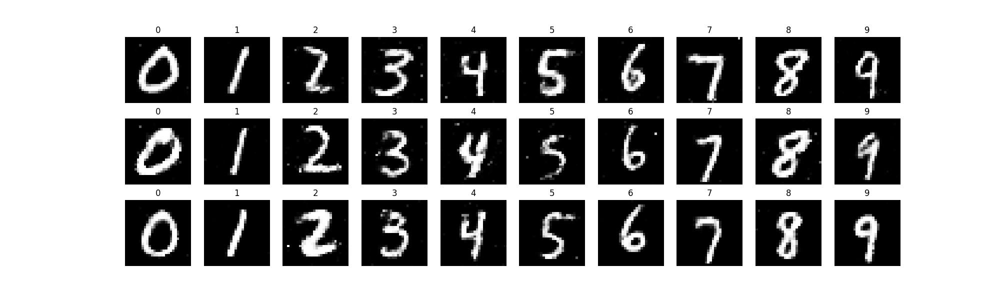

# GAN-NAML-Project

# JAX-based Generative Adversarial Network (GAN) on MNIST

## Table of Contents
- [Introduction](#introduction)
- [Installation](#installation)
- [Dataset](#dataset)
- [Model Architecture](#model-architecture)
- [Training](#training)
- [Results](#results)

## Introduction

This project implements a **Conditional Generative Adversarial Network (cGAN)** using [JAX](https://jax.readthedocs.io/en/latest/), a high-performance machine learning library.  
The model is trained on the **MNIST dataset** of handwritten digits (0–9).  

Unlike a standard GAN, the cGAN incorporates **class labels** into both the generator and discriminator:
- The **Generator** creates synthetic digit images conditioned on a given label.
- The **Discriminator** distinguishes between real and generated images while also considering the corresponding label.

## Installation

1. Clone this repository:
   ```bash
   git clone https://github.com/Lv1g1/GAN-NAML-Project.git
   cd gan-jax
   ```

2. Create a virtual environment and activate it:
   ```bash
   python -m venv env
   source env/bin/activate  # On Windows, use `env\Scripts\activate`
   ```

3. Install the dependencies:
   ```bash
   pip install -r requirements.txt
   ```

## Dataset

We use the **original MNIST dataset**, downloaded as the raw binary files (`train-images-idx3-ubyte`, `train-labels-idx1-ubyte`, `t10k-images-idx3-ubyte`, `t10k-labels-idx1-ubyte`).  

The dataset consists of **28×28 grayscale images** of handwritten digits 
from **0 to 9**.  

Before training, we preprocess the images by **normalizing pixel values** 
to the range **[-1, 1]**.

## Model Architecture

### Generator
The **Generator** takes a random latent vector **and a class label** as input.  
The label is one-hot encoded and concatenated with the latent vector.  
The architecture includes:
- Dense layers with ReLU activations
- A final dense layer with a `tanh` activation to produce **28×28 grayscale images** with pixel values in the range **[-1, 1]**

### Discriminator
The **Discriminator** takes an image **and a class label** as input.  
The label is embedded and concatenated with the flattened image.  
The architecture includes:
- Dense layers with Leaky ReLU activations
- A final dense layer with a `sigmoid` activation to output a probability indicating whether the image is real or generated

## Training

We train a **Conditional GAN (cGAN)** on MNIST using both image data and digit labels.  
The objective functions are:

- **Generator Loss**: Encourages the generator to produce images that the discriminator classifies as real.  
- **Discriminator Loss**: Encourages the discriminator to correctly distinguish between real and generated images.  

The training loop consists of:
1. Sampling a batch of real images and labels from the dataset.  
2. Generating fake images using the generator and the corresponding labels.  
3. Computing discriminator and generator losses.  
4. Updating model parameters using `optax.adam` with different learning rates and betas for each network.  

### Experiments
We trained multiple models with **different hyperparameters** to study their effect on training stability and image quality.  
During training, we:
- Monitored **loss curves** to detect issues such as mode collapse.  
- Periodically generated images (every 100 epochs) to visually inspect training progress.  
- Compared models both **during** and **after** training.  
- Evaluated final performance using the **Fréchet Inception Distance (FID)** on the validation set to select the best model.  

## Results

We trained four different models with varying learning rates, optimizers, and training schedules.  
Table 1 summarizes the hyperparameters and validation FID scores of each model.  

- **M1** and **M2**, trained with higher learning rates and different $\beta_1$ values, achieved FID scores around 74.  
- **M3**, with a slightly reduced discriminator learning rate and $\beta_1 = 0.5$, improved stability and reached an FID of **69.93**.  
- **M4**, which used a two-stage training schedule with decaying learning rates after 1600 epochs, achieved the best performance with a validation **FID of 34.74**. This indicates a substantial improvement in generated image quality compared to the other models.  

Overall, the results demonstrate that careful tuning of learning rates and adopting a learning rate decay strategy significantly improves GAN training stability and output quality.  

### Generated Samples (Best Model M4)

Below we show representative generated digits from the best-performing model (M4). These samples illustrate the model’s ability to generate realistic and diverse digits across all classes.


